# RFC-001: SportApp Backend Architecture

| Поле       | Значение                                                   |
|------------|------------------------------------------------------------|
| **RFC №**  | 001                                                        |
| **Статус** | Draft                                                      |
| **Версия** | 0.7.0                                                      |
| **Дата**   | 2025-06-14                                                 |
| **Проект** | SportApp — мобильное приложение для спортивных активностей |

### Changelog

| Версия | Изменения |
|--------|-----------|
| 0.7.0  | Удалён механизм подтверждения участия: убраны `requires_approval`, роль `SPECTATOR`, статус `PENDING`, ручки `/participants/accept` и `/participants/reject`. Join и leave — мгновенные без подтверждения. |
| 0.6.0  | Сквозная версионность всех сущностей. Endpoint `/version-check` в User Info. Все диаграммы переписаны на Mermaid. Добавлены Use Case и единая ERD. |
| 0.5.0  | Читающие сервисы на MongoDB, пишущие на PostgreSQL. `userId/type` ключи в User Info. Активности пользователя через User Info. |
| 0.4.0  | UML-диаграммы. Удалены ENUM и триггеры из DDL. |
| 0.3.0  | POST-only везде. Views как единственный фасад. |
| 0.2.0  | POST-only публичные ручки. Статусная машина активностей. |
| 0.1.0  | Первоначальный черновик. |

---

## Содержание

1. [Соглашения по транспорту](#1-соглашения-по-транспорту)
2. [Версионность](#2-версионность)
3. [Топология сервисов и хранилища](#3-топология-сервисов-и-хранилища)
4. [UML: Use Case](#4-uml-use-case)
5. [UML: Компонентная диаграмма](#5-uml-компонентная-диаграмма)
6. [UML: Sequence-диаграммы](#6-uml-sequence-диаграммы)
7. [UML: Диаграммы состояний](#7-uml-диаграммы-состояний)
8. [UML: ERD](#8-uml-erd)
9. [Views Service](#9-views-service)
10. [Auth Service](#10-auth-service)
11. [Activities Service](#11-activities-service)
12. [Activity Ops Service](#12-activity-ops-service)
13. [Map Activities Service](#13-map-activities-service)
14. [User Profiles Service](#14-user-profiles-service)
15. [User Info Service](#15-user-info-service)
16. [News Collector](#16-news-collector)
17. [News Feed Service](#17-news-feed-service)
18. [Kafka: топики и события](#18-kafka-топики-и-события)
19. [Схема базы данных](#19-схема-базы-данных)
20. [Обработка ошибок](#20-обработка-ошибок)
21. [Открытые вопросы](#21-открытые-вопросы)

---

## 1. Соглашения по транспорту

Все синхронные HTTP-вызовы используют `POST` с телом `application/json`. Тип операции кодируется в имени маршрута.

```
POST /{ресурс}/{действие}

Публичные:        /activities/create   /activities/get    /activities/join
Внутренние:       /internal/users/get  /internal/news/list
Административные: /admin/activities/list
```

**Конверт ответа:**
```json
{ "ok": true,  "data":  { ... } }
{ "ok": false, "error": { "code": "SOME_ERROR", "message": "..." } }
```

**HTTP-статусы:** `200` успех · `400` бизнес-ошибка · `401` нет JWT (Gateway) · `403` нет прав (Gateway) · `500` ошибка сервера.

---

## 2. Версионность

### 2.1 Концепция

Каждая мутируемая сущность в write-сервисе хранит монотонно возрастающее поле `version: bigint`. При любом изменении сущности версия инкрементируется и возвращается клиенту в ответе. Версия включается в Kafka-событие. Read-модель (MongoDB) сохраняет версию рядом с данными.

Это решает проблему гонки между write и read: клиент знает какую версию он ожидает увидеть в read-модели, и может поллить `version-check` пока read-модель не синхронизируется.

### 2.2 Где применяется

| Сущность        | Write-сервис     | Read-сервис    | MongoDB-тип      |
|-----------------|------------------|----------------|------------------|
| Профиль         | User Profiles    | User Info      | `userId/profile` |
| Активности юзера| Activities       | User Info      | `userId/activities` |
| Активность (гео)| Activities       | Map Activities | `map_activities` |

### 2.3 Поток версии при обновлении профиля

```
1. Client → POST /profile/update
2. User Profiles: UPDATE user_profiles SET ..., version = version + 1
3. User Profiles → ответ клиенту: { data: { updated: true, version: 42 } }
4. User Profiles → Kafka: user.profile_updated { userId, version: 42, username, avatarUrl }
5. User Info consumer: updateOne({ _id: "userId/profile" }, { $set: { ..., version: 42 } })
6. Client поллит: POST /internal/users/version-check { userId, type: "profile", expectedVersion: 42 }
7. User Info: возвращает { ready: true } когда version в MongoDB ≥ expectedVersion
```

### 2.4 Защита от устаревших событий

Consumer сравнивает версию входящего события с текущей в MongoDB. Если `event.version ≤ current.version` — событие игнорируется. Это обеспечивает идемпотентность при повторной доставке.

```javascript
// User Info consumer — логика upsert с версионностью
db.user_data.updateOne(
  { _id: `${userId}/profile`, version: { $lt: event.version } },
  { $set: { ...payload, version: event.version, updatedAt: new Date() } },
  { upsert: false }  // upsert отдельно для первого события
)
```

### 2.5 Версионность в схемах БД

**PostgreSQL (write-сервисы):** поле `version BIGINT NOT NULL DEFAULT 1` добавляется во все основные таблицы (`activities`, `user_profiles`). Инкрементируется на уровне приложения при каждом UPDATE.

**MongoDB (read-сервисы):** поле `version` в каждом документе `user_data` и `map_activities`.

---

## 3. Топология сервисов и хранилища

| Сервис               | Роль  | БД         | Обоснование |
|----------------------|-------|------------|-------------|
| Auth                 | Write | PostgreSQL | Уникальность email, FK токенов |
| Activities           | Write | PostgreSQL | Транзакции при `spots_left`, версионность |
| User Profiles        | Write | PostgreSQL | Уникальность username, версионность |
| Map Activities       | Read  | MongoDB    | Гео-индекс `2dsphere`, `$near`, обновления через Kafka |
| User Info            | Read  | MongoDB    | `userId/type` ключи, версионный polling |
| News Feed            | Read  | MongoDB    | TTL-индекс, гибкая схема |

---

## 4. UML: Use Case

```mermaid
flowchart TD
    subgraph Actors
        U(["👤 Пользователь"])
        A(["🛡 Администратор"])
        S(["⚙️ Система / Scheduler"])
    end

    subgraph UC["Use Cases"]
        direction TB

        subgraph Auth["Аутентификация"]
            UC1["Зарегистрироваться"]
            UC2["Войти"]
            UC3["Обновить токен"]
            UC4["Выйти"]
        end

        subgraph Profile["Профиль"]
            UC5["Просмотреть свой профиль"]
            UC6["Редактировать профиль"]
            UC7["Загрузить аватар"]
            UC8["Просмотреть профиль другого"]
        end

        subgraph Activities["Активности"]
            UC9["Создать активность"]
            UC10["Найти активности на карте"]
            UC11["Найти активности в списке"]
            UC12["Просмотреть детали активности"]
            UC13["Откликнуться на активность"]
            UC14["Покинуть активность"]
            UC15["Редактировать свою активность"]
            UC16["Удалить свою активность"]
        end

        subgraph Home["Главный экран"]
            UC19["Просмотреть ленту новостей"]
            UC20["Просмотреть свои активности"]
        end

        subgraph Admin["Модерация"]
            UC21["Просмотреть список активностей"]
            UC22["Пометить активность"]
            UC23["Удалить активность"]
        end

        subgraph System["Системные"]
            UC24["Собрать новости (cron)"]
            UC25["Синхронизировать read-модели (Kafka)"]
        end
    end

    U --> UC1 & UC2 & UC3 & UC4
    U --> UC5 & UC6 & UC7 & UC8
    U --> UC9 & UC10 & UC11 & UC12 & UC13 & UC14 & UC15 & UC16
    U --> UC19 & UC20

    A --> UC2
    A --> UC21 & UC22 & UC23

    S --> UC24 & UC25
```

---

## 5. UML: Компонентная диаграмма

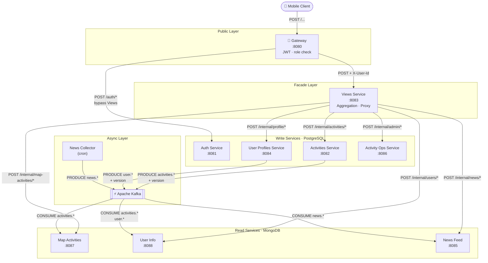

---

## 6. UML: Sequence-диаграммы

### 6.1 Экран «Главная»

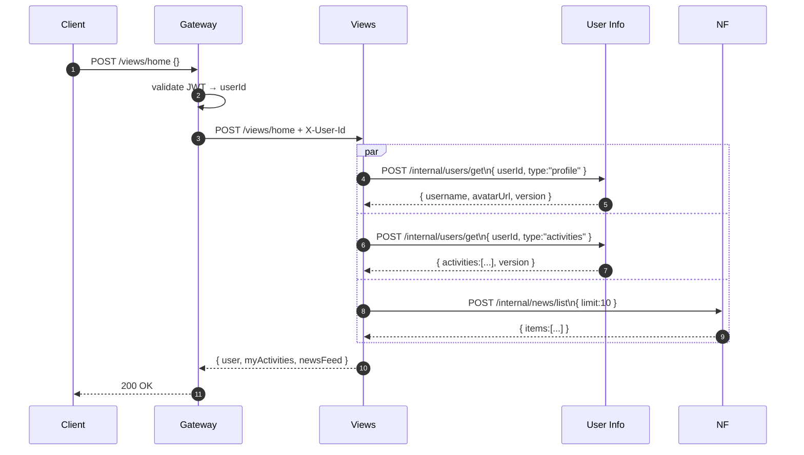

---

### 6.2 Обновление профиля + версионный polling

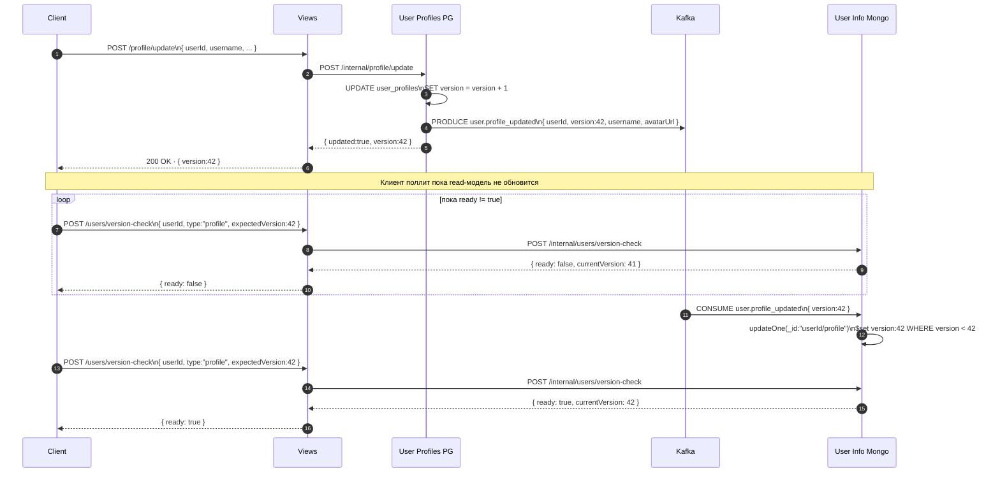

---

### 6.3 Создание активности → синхронизация read-моделей

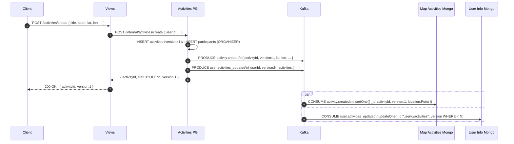

---

### 6.4 Join и leave активности

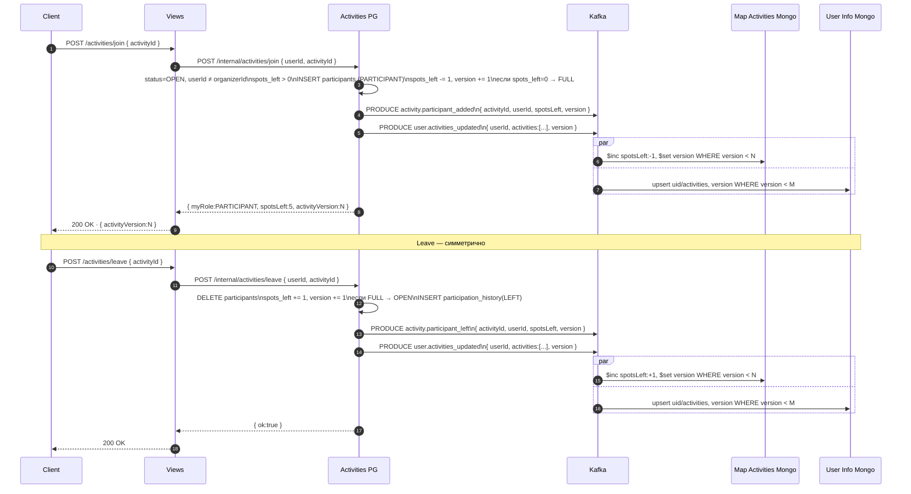

---

## 7. UML: Диаграммы состояний

### 7.1 Жизненный цикл активности

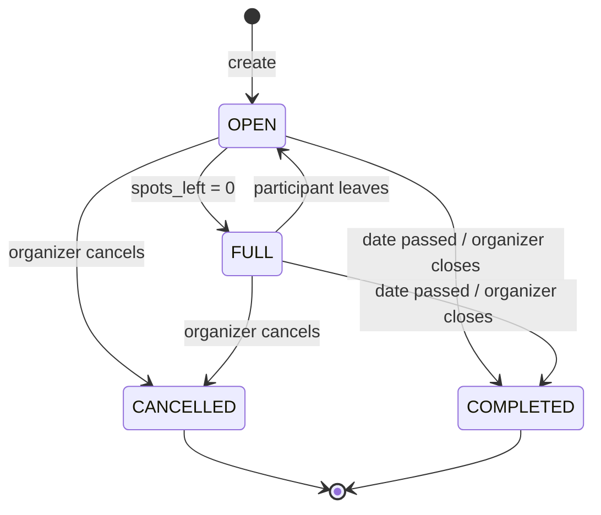

### 7.2 Жизненный цикл участника

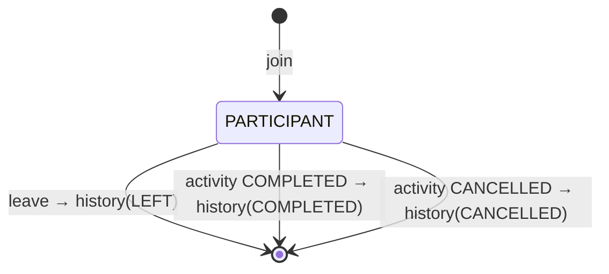

### 7.3 Жизненный цикл версионного polling

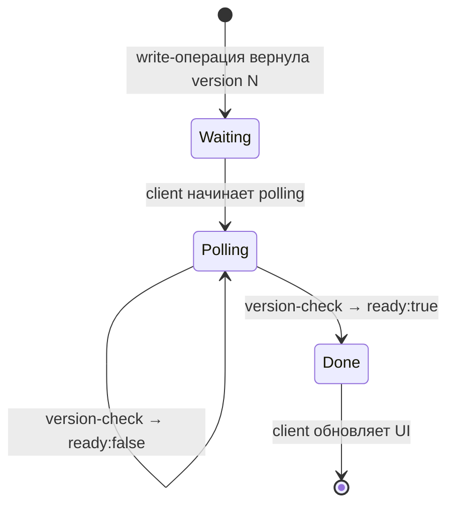

---

## 8. UML: ERD

### 8.1 Write-сервисы (PostgreSQL)

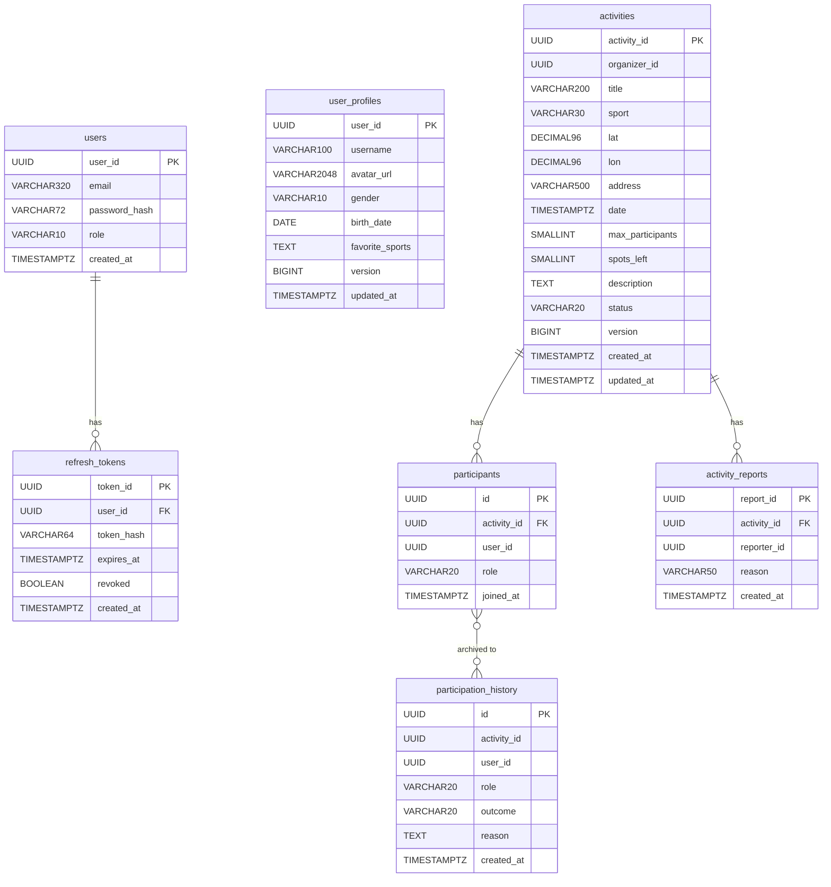

### 8.2 Read-сервисы (MongoDB)

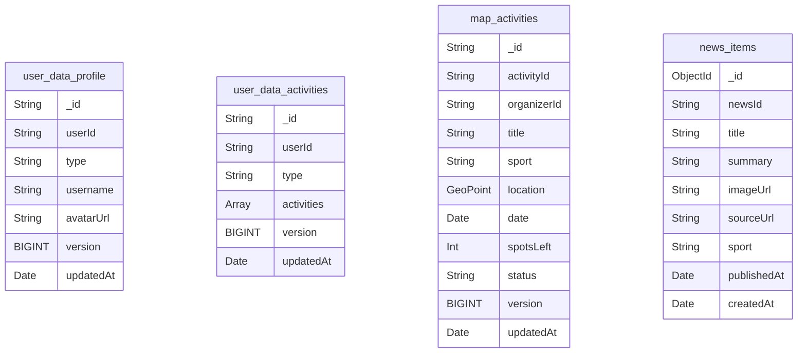

---

## 9. Views Service

**Порт:** `8083`

### 9.1 Агрегация

#### `POST /views/home`

**Внутренние вызовы (параллельно):**
```
POST user-info:8088  /internal/users/get   { userId, type:"profile" }
POST user-info:8088  /internal/users/get   { userId, type:"activities" }
POST news-feed:8085  /internal/news/list   { limit:10, offset:0 }
```

**Response:**
```json
{
  "ok": true,
  "data": {
    "user": { "userId":"uuid", "name":"Алексей", "avatarUrl":"https://...", "version":5 },
    "myActivities": [
      { "activityId":"uuid", "title":"Футбол в парке", "sport":"football",
        "date":"2025-06-15T18:00:00Z", "status":"OPEN", "myRole":"ORGANIZER" }
    ],
    "newsFeed": [
      { "newsId":"uuid", "title":"ЦСКА победил Зенит 2:1", "imageUrl":"https://...",
        "sport":"football", "publishedAt":"2025-06-14T12:00:00Z" }
    ]
  }
}
```

---

#### `POST /views/map`

**Request:** `{ "lat":55.75, "lon":37.61, "radius":3000, "sport":"football" }`

**Внутренние вызовы:**
```
POST map-activities:8087  /internal/map-activities/search  { lat, lon, radius, sport }
POST user-info:8088        /internal/users/batch            { userIds:[...organizerIds], type:"profile" }
```

**Response:**
```json
{
  "ok": true,
  "data": {
    "markers": [
      { "activityId":"uuid", "title":"Баскетбол у метро", "sport":"basketball",
        "lat":55.7401, "lon":37.6200, "date":"2025-06-15T18:00:00Z",
        "spotsLeft":3, "status":"OPEN", "version":2,
        "organizer": { "userId":"uuid", "name":"Иван", "avatarUrl":"https://..." } }
    ],
    "list": [
      { "activityId":"uuid", "title":"Баскетбол у метро", "sport":"basketball",
        "address":"ул. Тверская", "date":"2025-06-15T18:00:00Z", "spotsLeft":3, "status":"OPEN" }
    ]
  }
}
```

---

### 9.2 Таблица проксирования

#### Активности → Activities Service :8082

| Публичный маршрут            | Внутренний маршрут                    |
|------------------------------|---------------------------------------|
| `POST /activities/create`    | `POST /internal/activities/create`    |
| `POST /activities/get`       | `POST /internal/activities/get`       |
| `POST /activities/list`      | `POST /internal/activities/list`      |
| `POST /activities/update`    | `POST /internal/activities/update`    |
| `POST /activities/delete`    | `POST /internal/activities/delete`    |
| `POST /activities/join`      | `POST /internal/activities/join`      |
| `POST /activities/leave`     | `POST /internal/activities/leave`     |

#### Профиль → User Profiles Service :8084

| Публичный маршрут           | Внутренний маршрут                   |
|-----------------------------|--------------------------------------|
| `POST /profile/get`         | `POST /internal/profile/get`         |
| `POST /profile/get-by-id`   | `POST /internal/profile/get-by-id`   |
| `POST /profile/update`      | `POST /internal/profile/update`      |
| `POST /profile/avatar`      | `POST /internal/profile/avatar`      |

#### Версионный polling → User Info Service :8088

| Публичный маршрут            | Внутренний маршрут                        |
|------------------------------|-------------------------------------------|
| `POST /users/version-check`  | `POST /internal/users/version-check`      |

#### Новости → News Feed Service :8085

| Публичный маршрут  | Внутренний маршрут         |
|--------------------|----------------------------|
| `POST /news/list`  | `POST /internal/news/list` |

#### Администрирование → Activity Ops Service :8086

| Публичный маршрут                 | Внутренний маршрут                        |
|-----------------------------------|-------------------------------------------|
| `POST /admin/activities/list`     | `POST /internal/admin/activities/list`    |
| `POST /admin/activities/get`      | `POST /internal/admin/activities/get`     |
| `POST /admin/activities/flag`     | `POST /internal/admin/activities/flag`    |
| `POST /admin/activities/delete`   | `POST /internal/admin/activities/delete`  |

---

## 10. Auth Service

Gateway проксирует `/auth/*` напрямую, минуя Views.

**Порт:** `8081` | **БД:** PostgreSQL

#### `POST /auth/register`
**Request:** `{ email, password, username }`
**Response:** `{ userId, accessToken, refreshToken, expiresIn }`

#### `POST /auth/login`
**Request:** `{ email, password }`
**Response:** `{ accessToken, refreshToken, expiresIn }`

#### `POST /auth/refresh`
**Request:** `{ refreshToken }`
**Response:** `{ accessToken, expiresIn }`

#### `POST /auth/logout`
**Request:** `{ refreshToken }`
**Response:** `{ ok:true, data:null }`

**JWT Payload:** `{ sub:uuid, role:"USER"|"ADMIN", iat, exp }`

---

## 11. Activities Service

**Порт:** `8082` | **БД:** PostgreSQL

### 11.1 Статусы активности

| Статус      | Описание                          |
|-------------|-----------------------------------|
| `OPEN`      | Принимает участников              |
| `FULL`      | Лимит достигнут                   |
| `COMPLETED` | Мероприятие состоялось            |
| `CANCELLED` | Отменена организатором            |

### 11.2 Роли участника

| Роль          | Описание                                              |
|---------------|-------------------------------------------------------|
| `ORGANIZER`   | Создатель. Редактирует и удаляет активность.          |
| `PARTICIPANT` | Участник. Учитывается в `spots_left`.                 |

### 11.3 Endpoints

#### `POST /internal/activities/create`
```json
// Request
{ "userId":"uuid", "title":"Футбол в парке", "sport":"football",
  "lat":55.7305, "lon":37.6015, "address":"Парк Горького, площадка 3",
  "date":"2025-06-15T18:00:00Z", "maxParticipants":10,
  "description":"Дружеский матч" }

// Response
{ "ok":true, "data": { "activityId":"uuid", "status":"OPEN", "version":1 } }
```
> INSERT activities (version=1) + INSERT participants (ORGANIZER).  
> PRODUCE `activity.created` + `user.activities_updated` в Kafka.

---

#### `POST /internal/activities/get`
```json
// Request: { "userId":"uuid", "activityId":"uuid" }
// Response
{ "ok":true, "data": {
    "activityId":"uuid", "title":"...", "sport":"football", "status":"OPEN",
    "lat":55.7305, "lon":37.6015, "address":"...",
    "date":"...", "maxParticipants":10, "spotsLeft":6, "description":"...",
    "version":3,
    "organizer": { "userId":"uuid", "name":"Алексей", "avatarUrl":"https://..." },
    "participants": [
      { "userId":"uuid", "name":"Иван", "avatarUrl":"https://...",
        "role":"PARTICIPANT", "joinedAt":"..." }
    ],
    "myRole": "PARTICIPANT"
}}
```

---

#### `POST /internal/activities/list`
```json
// Request
{ "userId":"uuid", "lat":55.75, "lon":37.61, "radius":5000,
  "sport":"football", "date":"2025-06-15", "status":"OPEN", "limit":20, "offset":0 }
// Response: { items:[{ activityId, title, spotsLeft, status, version, ... }], total:47 }
```

---

#### `POST /internal/activities/update`
```json
// Request: { "userId":"uuid", "activityId":"uuid", "title":"Новое название" }
// Response: { "ok":true, "data": { "activityId":"uuid", "updated":true, "version":4 } }
```
> version += 1. PRODUCE `activity.updated` в Kafka.

---

#### `POST /internal/activities/delete`
```json
// Request: { "userId":"uuid", "activityId":"uuid" }
// Response: { "ok":true, "data":null }
```
> PRODUCE `activity.deleted` + `user.activities_updated` для всех участников в Kafka.

---

#### `POST /internal/activities/join`
```json
// Request: { "userId":"uuid", "activityId":"uuid" }
// Response: { "ok":true, "data": { "myRole":"PARTICIPANT", "spotsLeft":5, "activityVersion":5 } }
```

**Логика:**
```
1. status = OPEN
2. userId ≠ organizerId
3. Нет записи (activityId, userId) в participants
4. spots_left > 0
5. INSERT participants (PARTICIPANT)
6. spots_left -= 1; activity.version += 1
7. если spots_left = 0 → FULL
```
> PRODUCE `activity.participant_added` + `user.activities_updated` в Kafka.

---

#### `POST /internal/activities/leave`
```json
// Request: { "userId":"uuid", "activityId":"uuid" }
// Response: { "ok":true, "data":null }
```

**Логика:**
```
1. Найти запись (activityId, userId), role ≠ ORGANIZER
2. Если PARTICIPANT: spots_left += 1; если FULL → OPEN; activity.version += 1
3. DELETE из participants
4. INSERT participation_history (outcome=LEFT)
```
> PRODUCE `activity.participant_left` + `user.activities_updated` в Kafka.

---

### 11.4 Kafka Producer

| Триггер                    | Событие                       | Затронутые userId                              |
|----------------------------|-------------------------------|------------------------------------------------|
| `create`                   | `activity.created`            | —                                              |
| `create`                   | `user.activities_updated`     | organizerId                                    |
| `update`                   | `activity.updated`            | —                                              |
| `delete`                   | `activity.deleted`            | —                                              |
| `delete`                   | `user.activities_updated`     | organizerId + все из `participants`            |
| `join`                     | `activity.participant_added`  | —                                              |
| `join`                     | `user.activities_updated`     | userId                                         |
| `leave`                    | `activity.participant_left`   | —                                              |
| `leave`                    | `user.activities_updated`     | userId                                         |
| `status_changed`           | `activity.status_changed`     | —                                              |
| `status_changed`           | `user.activities_updated`     | все участники из `participants`                |

---

### 11.5 Бизнес-коды ошибок

| code                        | Описание                                      |
|-----------------------------|-----------------------------------------------|
| `ACTIVITY_NOT_FOUND`        | Активность не найдена                         |
| `ACTIVITY_NOT_OPEN`         | Статус не позволяет операцию                  |
| `ALREADY_JOINED`            | Уже является участником                       |
| `NO_SPOTS_LEFT`             | Мест нет                                      |
| `CANNOT_JOIN_OWN_ACTIVITY`  | Организатор не может подать заявку            |
| `NOT_ORGANIZER`             | Только для организатора                       |
| `PARTICIPANT_NOT_FOUND`     | Запись участника не найдена                   |
| `CANNOT_LEAVE_AS_ORGANIZER` | Организатор не может покинуть активность      |

---

## 12. Activity Ops Service

**Порт:** `8086` | Доступ: только role=ADMIN

#### `POST /internal/admin/activities/list`
```json
// Request: { "flagStatus":"flagged", "limit":50, "offset":0 }
// Response: { items:[{ activityId, reportsCount, status }], total:5 }
```

#### `POST /internal/admin/activities/get`
```json
// Request: { "activityId":"uuid" }
// Response: полная схема + reports:[{ reason, reportedBy, createdAt }]
```

#### `POST /internal/admin/activities/flag`
```json
// Request: { "activityId":"uuid", "reason":"spam" }
```

#### `POST /internal/admin/activities/delete`
```json
// Request: { "activityId":"uuid" }
```
> Проксирует в Activities Service → `activity.deleted` в Kafka.

---

## 13. Map Activities Service

**Порт:** `8087` (внутренний) | **БД:** MongoDB

#### `POST /internal/map-activities/search`
```json
// Request
{ "lat":55.75, "lon":37.61, "radius":3000, "sport":"football", "dateFrom":"2025-06-15" }
// Response
{ "ok":true, "data": { "markers": [
  { "activityId":"uuid", "organizerId":"uuid", "title":"...", "sport":"basketball",
    "lat":55.74, "lon":37.62, "date":"...", "spotsLeft":3, "status":"OPEN", "version":2 }
]}}
```

**MongoDB запрос:**
```javascript
db.map_activities.find({
  location: { $near: { $geometry: { type:"Point", coordinates:[lon,lat] }, $maxDistance: radius } },
  ...(sport && { sport }),
  date: { $gte: new Date() },
  status: { $in: ["OPEN","FULL"] }
}).limit(200)
```

**Kafka Consumer:**

| Событие                      | MongoDB-операция                                                    |
|------------------------------|---------------------------------------------------------------------|
| `activity.created`           | `insertOne({ _id:activityId, location:Point, version:1, ... })`    |
| `activity.updated`           | `updateOne WHERE version < N → $set fields + version`              |
| `activity.status_changed`    | `updateOne WHERE version < N → $set status + version`              |
| `activity.participant_added` | `updateOne WHERE version < N → $inc spotsLeft:-1, $set version`    |
| `activity.participant_left`  | `updateOne WHERE version < N → $inc spotsLeft:+1, $set version`    |
| `activity.deleted`           | `deleteOne({ _id:activityId })`                                    |

**Индексы:**
```javascript
db.map_activities.createIndex({ location: "2dsphere" })
db.map_activities.createIndex({ sport: 1, date: 1 })
db.map_activities.createIndex({ status: 1 })
```

---

## 14. User Profiles Service

**Порт:** `8084` | **БД:** PostgreSQL

#### `POST /internal/profile/get`
```json
// Request: { "userId":"uuid" }
// Response: { userId, username, avatarUrl, gender, age, birthDate, favoriteSports, version }
```

#### `POST /internal/profile/get-by-id`
```json
// Request: { "userId":"uuid", "targetUserId":"uuid" }
// Response: { userId, username, avatarUrl, favoriteSports }
```

#### `POST /internal/profile/update`
```json
// Request: { "userId":"uuid", "username":"...", "gender":"MALE", "birthDate":"1999-03-15", "favoriteSports":["football"] }
// Response: { "ok":true, "data": { "updated":true, "version":5 } }
```
> version += 1. PRODUCE `user.profile_updated { version:5 }` в Kafka.

#### `POST /internal/profile/avatar`
`multipart/form-data` — поля `userId` и `file`.
> version += 1. PRODUCE `user.profile_updated` в Kafka.

---

## 15. User Info Service

**Порт:** `8088` (внутренний) | **БД:** MongoDB

### 15.1 Схема ключей

Коллекция `user_data`. `_id = "{userId}/{type}"`.

```
"a1b2c3/profile"      — публичное имя и аватар          ← MVP
"a1b2c3/activities"   — список активностей пользователя  ← MVP
"a1b2c3/preferences"  — настройки и предпочтения         ← будущее
"a1b2c3/stats"        — статистика, рейтинг              ← будущее
```

Каждый документ содержит поле `version` — копию версии из write-сервиса. Consumer применяет событие только если `event.version > current.version`.

### 15.2 Структура документов

```javascript
// profile
{ _id:"uuid/profile", userId:"uuid", type:"profile",
  username:"sport_fan", avatarUrl:"https://...",
  version: 5, updatedAt: ISODate("...") }

// activities
{ _id:"uuid/activities", userId:"uuid", type:"activities",
  activities: [
    { activityId:"uuid", title:"Футбол", sport:"football",
      date: ISODate("..."), status:"OPEN", myRole:"ORGANIZER" }
  ],
  version: 12, updatedAt: ISODate("...") }
```

### 15.3 Endpoints

#### `POST /internal/users/get`
```json
// Request: { "userId":"uuid", "type":"profile" }
// Response: { userId, type, version, username, avatarUrl }

// Request: { "userId":"uuid", "type":"activities" }
// Response: { userId, type, version, activities:[...] }
```
```javascript
db.user_data.findOne({ _id: `${userId}/${type}` })
```

---

#### `POST /internal/users/batch`
```json
// Request: { "userIds":["uuid1","uuid2"], "type":"profile" }
// Response: { "users": [ { userId, username, avatarUrl, version } ] }
```
```javascript
const ids = userIds.map(id => `${id}/profile`)
db.user_data.find({ _id: { $in: ids } })
```

---

#### `POST /internal/users/get-all`
```json
// Request: { "userId":"uuid" }
// Response: { "docs": [ { type:"profile", ... }, { type:"activities", ... } ] }
```

---

#### `POST /internal/users/version-check`
```json
// Request: { "userId":"uuid", "type":"profile", "expectedVersion":42 }
// Response: { "ready":true,  "currentVersion":42 }
// Response: { "ready":false, "currentVersion":41 }
```
```javascript
const doc = db.user_data.findOne(
  { _id: `${userId}/${type}` },
  { projection: { version: 1 } }
)
return { ready: doc.version >= expectedVersion, currentVersion: doc.version }
```

---

### 15.4 Kafka Consumer

| Событие                   | Тип    | MongoDB-операция                                                                                                  |
|---------------------------|--------|-------------------------------------------------------------------------------------------------------------------|
| `user.profile_updated`    | profile | `updateOne({ _id:"uid/profile", version:{$lt:N} }, { $set:{...payload, version:N} }, { upsert:true })`          |
| `user.activities_updated` | activities | `updateOne({ _id:"uid/activities", version:{$lt:N} }, { $set:{activities, version:N} }, { upsert:true })` |

### 15.5 Индексы

```javascript
db.user_data.createIndex({ userId: 1, type: 1 })
```

---

## 16. News Collector

Scheduled worker. Cron: `0 6 * * *`.

```
1. GET {NEWS_API_URL}?category=sports&language=ru&pageSize=50
2. Для каждой статьи:
   a. hash = SHA256(sourceUrl)
   b. Если hash в seen_news → пропустить
   c. Нормализовать → NewsItem
   d. PRODUCE news.created в Kafka
   e. Сохранить hash в seen_news (TTL: 30 дней)
```

---

## 17. News Feed Service

**Порт:** `8085` | **БД:** MongoDB

#### `POST /internal/news/list`
```json
// Request: { "limit":10, "offset":0, "sport":"football" }
// Response: { items:[{ newsId, title, summary, imageUrl, sourceUrl, sport, publishedAt }], total:240 }
```

**Kafka Consumer:** `news.created` → `insertOne`.

**Индексы:**
```javascript
db.news_items.createIndex({ publishedAt: -1 })
db.news_items.createIndex({ sport: 1, publishedAt: -1 })
db.news_items.createIndex({ sourceUrl: 1 }, { unique: true })
db.news_items.createIndex({ createdAt: 1 }, { expireAfterSeconds: 2592000 }) // TTL 30 дней
```

---

## 18. Kafka: топики и события

### Топики

| Топик        | Партиции | Retention | Producers             | Consumers                 |
|--------------|----------|-----------|-----------------------|---------------------------|
| `activities` | 6        | 7 дней    | Activities            | Map Activities, User Info |
| `users`      | 3        | 7 дней    | User Profiles, Activities | User Info              |
| `news`       | 1        | 30 дней   | News Collector        | News Feed                 |

### Схемы событий

```json
// activity.created
{ "eventType":"activity.created", "activityId":"uuid", "organizerId":"uuid",
  "title":"...", "sport":"football", "lat":55.73, "lon":37.60, "address":"...",
  "date":"...", "maxParticipants":10, "requiresApproval":false,
  "status":"OPEN", "version":1, "occurredAt":"..." }

// activity.updated
{ "eventType":"activity.updated", "activityId":"uuid",
  "version":4, "title":"...", "occurredAt":"..." }

// activity.status_changed
{ "eventType":"activity.status_changed", "activityId":"uuid",
  "previousStatus":"OPEN", "newStatus":"FULL", "version":5, "occurredAt":"..." }

// activity.participant_added
{ "eventType":"activity.participant_added", "activityId":"uuid",
  "userId":"uuid", "role":"PARTICIPANT", "spotsLeft":5, "version":6, "occurredAt":"..." }

// activity.participant_left
{ "eventType":"activity.participant_left", "activityId":"uuid",
  "userId":"uuid", "spotsLeft":6, "version":7, "occurredAt":"..." }

// activity.deleted
{ "eventType":"activity.deleted", "activityId":"uuid", "version":8, "occurredAt":"..." }

// user.profile_updated
{ "eventType":"user.profile_updated", "userId":"uuid",
  "username":"new_name", "avatarUrl":"https://...", "version":5, "occurredAt":"..." }

// user.activities_updated
{ "eventType":"user.activities_updated", "userId":"uuid",
  "activities": [
    { "activityId":"uuid", "title":"...", "sport":"football",
      "date":"...", "status":"OPEN", "myRole":"ORGANIZER" }
  ],
  "version":12, "occurredAt":"..." }

// news.created
{ "eventType":"news.created", "newsId":"uuid", "title":"...", "summary":"...",
  "imageUrl":"...", "sourceUrl":"...", "sport":"football",
  "publishedAt":"...", "occurredAt":"..." }
```

---

## 19. Схема базы данных

> **Соглашения:** VARCHAR + CHECK вместо ENUM. Триггеры не используются. `version` инкрементируется на уровне приложения. `updated_at` обновляется на уровне приложения.

### 19.1 Auth Service — PostgreSQL

```sql
CREATE TABLE users (
    user_id       UUID         PRIMARY KEY DEFAULT gen_random_uuid(),
    email         VARCHAR(320) NOT NULL,
    password_hash VARCHAR(72)  NOT NULL,
    role          VARCHAR(10)  NOT NULL DEFAULT 'USER'
                      CHECK (role IN ('USER','ADMIN')),
    created_at    TIMESTAMPTZ  NOT NULL DEFAULT now(),
    CONSTRAINT uq_users_email UNIQUE (email)
);

CREATE TABLE refresh_tokens (
    token_id   UUID         PRIMARY KEY DEFAULT gen_random_uuid(),
    user_id    UUID         NOT NULL REFERENCES users(user_id) ON DELETE CASCADE,
    token_hash VARCHAR(64)  NOT NULL,
    expires_at TIMESTAMPTZ  NOT NULL,
    revoked    BOOLEAN      NOT NULL DEFAULT false,
    created_at TIMESTAMPTZ  NOT NULL DEFAULT now(),
    CONSTRAINT uq_refresh_token UNIQUE (token_hash)
);

CREATE INDEX idx_refresh_tokens_user_id ON refresh_tokens(user_id);
CREATE INDEX idx_refresh_tokens_expires ON refresh_tokens(expires_at);
```

---

### 19.2 Activities Service — PostgreSQL

```sql
CREATE TABLE activities (
    activity_id       UUID         PRIMARY KEY DEFAULT gen_random_uuid(),
    organizer_id      UUID         NOT NULL,
    title             VARCHAR(200) NOT NULL,
    sport             VARCHAR(30)  NOT NULL
                          CHECK (sport IN ('football','basketball','volleyball','tennis',
                                           'badminton','running','cycling','swimming','parkour','other')),
    lat               DECIMAL(9,6) NOT NULL,
    lon               DECIMAL(9,6) NOT NULL,
    address           VARCHAR(500) NOT NULL,
    date              TIMESTAMPTZ  NOT NULL,
    max_participants  SMALLINT     NOT NULL CHECK (max_participants BETWEEN 2 AND 1000),
    spots_left        SMALLINT     NOT NULL CHECK (spots_left >= 0),
    description       TEXT,
    status            VARCHAR(20)  NOT NULL DEFAULT 'OPEN'
                          CHECK (status IN ('OPEN','FULL','COMPLETED','CANCELLED')),
    version           BIGINT       NOT NULL DEFAULT 1,
    created_at        TIMESTAMPTZ  NOT NULL DEFAULT now(),
    updated_at        TIMESTAMPTZ  NOT NULL DEFAULT now(),
    CONSTRAINT chk_spots_not_exceed CHECK (spots_left <= max_participants)
);

CREATE INDEX idx_activities_status_date ON activities(status, date);
CREATE INDEX idx_activities_sport       ON activities(sport);
CREATE INDEX idx_activities_organizer   ON activities(organizer_id);

CREATE TABLE participants (
    id          UUID        PRIMARY KEY DEFAULT gen_random_uuid(),
    activity_id UUID        NOT NULL REFERENCES activities(activity_id) ON DELETE CASCADE,
    user_id     UUID        NOT NULL,
    role        VARCHAR(20) NOT NULL CHECK (role IN ('ORGANIZER','PARTICIPANT')),
    joined_at   TIMESTAMPTZ NOT NULL DEFAULT now(),
    CONSTRAINT uq_participant UNIQUE (activity_id, user_id)
);

CREATE INDEX idx_participants_activity ON participants(activity_id);
CREATE INDEX idx_participants_user     ON participants(user_id);

CREATE TABLE participation_history (
    id          UUID        PRIMARY KEY DEFAULT gen_random_uuid(),
    activity_id UUID        NOT NULL,
    user_id     UUID        NOT NULL,
    role        VARCHAR(20) NOT NULL CHECK (role IN ('ORGANIZER','PARTICIPANT')),
    outcome     VARCHAR(20) NOT NULL CHECK (outcome IN ('COMPLETED','LEFT','CANCELLED')),
    created_at  TIMESTAMPTZ NOT NULL DEFAULT now()
);

CREATE INDEX idx_ph_user_id      ON participation_history(user_id);
CREATE INDEX idx_ph_activity_id  ON participation_history(activity_id);
CREATE INDEX idx_ph_user_created ON participation_history(user_id, created_at DESC);

CREATE TABLE activity_reports (
    report_id   UUID        PRIMARY KEY DEFAULT gen_random_uuid(),
    activity_id UUID        NOT NULL REFERENCES activities(activity_id) ON DELETE CASCADE,
    reporter_id UUID        NOT NULL,
    reason      VARCHAR(50) NOT NULL
                    CHECK (reason IN ('spam','inappropriate','fake','dangerous','other')),
    created_at  TIMESTAMPTZ NOT NULL DEFAULT now(),
    CONSTRAINT uq_report UNIQUE (activity_id, reporter_id)
);

CREATE INDEX idx_reports_activity ON activity_reports(activity_id);
```

---

### 19.3 User Profiles Service — PostgreSQL

```sql
CREATE TABLE user_profiles (
    user_id         UUID          PRIMARY KEY,
    username        VARCHAR(100)  NOT NULL,
    avatar_url      VARCHAR(2048),
    gender          VARCHAR(10)   CHECK (gender IN ('MALE','FEMALE','OTHER')),
    birth_date      DATE,
    favorite_sports TEXT          NOT NULL DEFAULT '',
    version         BIGINT        NOT NULL DEFAULT 1,
    updated_at      TIMESTAMPTZ   NOT NULL DEFAULT now(),
    CONSTRAINT uq_username UNIQUE (username)
);
```

---

## 20. Обработка ошибок

```json
{ "ok": false, "error": { "code": "NOT_ORGANIZER", "message": "Only the organizer can perform this action" } }
```

**Auth:**

| code                   | Описание                    |
|------------------------|-----------------------------|
| `EMAIL_ALREADY_EXISTS` | Email занят                 |
| `INVALID_CREDENTIALS`  | Неверный email или пароль   |
| `TOKEN_EXPIRED`        | Refresh-токен истёк         |
| `TOKEN_REVOKED`        | Refresh-токен инвалидирован |

**Activities:** см. раздел 11.5.

---

## 21. Открытые вопросы

| #  | Вопрос                                                                  | Приоритет |
|----|-------------------------------------------------------------------------|-----------|
| 1  | Какой внешний API для новостей? Нужна оценка квот.                      | Высокий   |
| 2  | Push-уведомления при принятии заявки / новом участнике?                  | Средний   |
| 3  | База площадок: OpenStreetMap Overpass API или ручная модерация?          | Средний   |
| 4  | Автоматический перевод в `COMPLETED`: по дате или вручную?               | Средний   |
| 5  | Таймаут и максимальное число итераций для version-check polling?         | Средний   |
| 6  | `favorite_sports`: TEXT или отдельная таблица при наличии фильтрации?   | Низкий    |
